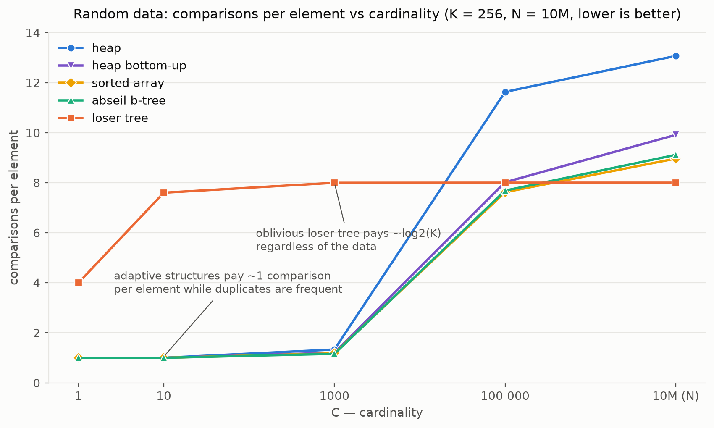

# K-way merge benchmark

## Motivation

This benchmark is created to compare different sorting data structures for [k-way merge algorithm](https://en.wikipedia.org/wiki/K-way_merge_algorithm)
scenario, merging `K` sorted streams into a single sorted stream.

The benchmark measures number of comparisons per element instead of time. In practice this is the most important metric: in databases you compare
long strings, rows from multiple columns, use comparators with virtual calls, so most of the merge time is spent inside comparisons. Comparisons
count is also deterministic, it does not depend on hardware, compiler or optimization level, only on the algorithm, the data and the seed.

Benchmark works in two modes: generated random data and real data from ClickHouse generated file.

In generated random data mode benchmark has 3 parameters:

1. `N` - number of elements.
2. `K` - number of cursors (sorted streams).
3. `C` - cardinality. Values are generated using uniform integer distribution in `[0, C)`, so cardinality controls the amount of duplicates:
`1` - all values are equal, `N` - all values are almost surely unique.

Values are split into cursors in generation order (random layout): every cursor covers the whole value range.

In file mode benchmark takes `K` and a file with `UInt64` column exported from ClickHouse. The column is split into `K` contiguous
ranges in file order, so cursor value ranges intersect the same way as in the original data.

In both modes every cursor is sorted locally before the merge.

Elements are compared as `(value, cursor_index)` pairs, so comparisons form total order and merge is stable.

Results on real data. Rank encoded columns of the ClickBench hits dataset (100 million rows), split into K = 256 cursors in table order, each cursor sorted locally and merged. Metric: average number of comparisons per element, lower is better.
```
┌───────────────────────────────────────────────────┬────────┬────────────────┬──────────────┬──────────────┬────────────┐
│                       Column                      │  heap  │ heap_bottom_up │ sorted_array │ abseil_btree │ loser_tree │
├───────────────────────────────────────────────────┼────────┼────────────────┼──────────────┼──────────────┼────────────┤
│ CounterID (primary key, sorted)                   │  0.996 │          0.996 │        0.996 │        0.996 │      4.000 │
│ AdvEngineID (19 distinct values)                  │  1.000 │          1.000 │        1.000 │        1.000 │      7.865 │
│ TraficSourceID (10 distinct values)               │  1.000 │          1.000 │        1.000 │        1.000 │      7.986 │
│ RegionID (9K distinct values)                     │  1.044 │          1.029 │        1.027 │        1.027 │      8.000 │
│ SearchPhrase (6M distinct values, ~90% empty)     │  1.658 │          1.755 │        1.563 │        1.587 │      8.000 │
│ URL (18.3M distinct values)                       │  1.969 │          3.029 │        2.300 │        2.361 │      7.984 │
│ UserID (17.6M distinct values)                    │  3.069 │          3.082 │        2.637 │        2.678 │      7.603 │
│ URLHash (20.7M distinct values)                   │  4.074 │          3.425 │        3.092 │        3.151 │      8.000 │
│ EventTime (1.4M distinct values)                  │  4.926 │          4.363 │        3.810 │        3.924 │      7.733 │
│ WatchID (almost unique)                           │ 13.066 │          9.916 │        8.965 │        9.114 │      8.000 │
└───────────────────────────────────────────────────┴────────┴────────────────┴──────────────┴──────────────┴────────────┘
```

Results on random data:


For more information, take a look at my blog post about [k-way merge](https://maksimkita.com/blog/k-way-merge.html).

## Examples

Benchmark itself is a `k_way_merge_benchmark` binary that takes `--strategy`, `--K` (cursors), `--N` (elements), `--C` (cardinality),
optional `--layout` (`random` by default) and `--seed` (42 by default) and runs k-way merge with comparisons counting:

```
k_way_merge_benchmark --strategy sorted_array --K 64 --N 10000000 --C 1000

Strategy: sorted_array
Cursors size: 64
Elements size: 10000000
Cardinality: 1000
Seed: 42
Layout: random
Init comparisons: 307
Merge comparisons: 10319461
Total comparisons: 10319768
Comparisons per element: 1.03198
```

Instead of generated values benchmark can replay real data: `--file` reads the whole `UInt64` column exported from ClickHouse in
`RowBinaryWithNamesAndTypes` format and splits it into contiguous ranges in file order. `--N`, `--C`, `--layout` and `--seed`
are not applicable in this mode:

```
clickhouse client --query "SELECT toUInt64(CounterID) AS value FROM hits INTO OUTFILE 'CounterID.bin'
    FORMAT RowBinaryWithNamesAndTypes SETTINGS max_threads = 1"

k_way_merge_benchmark --strategy heap --K 1024 --file CounterID.bin
```

There are two wrappers around `k_way_merge_benchmark` that run it for each combination of parameters and build results tables:
`benchmark_random.py` for generated data (lists of strategies, cursors sizes, elements sizes and cardinalities) and `benchmark.py`
for rank encoded hits columns (lists of strategies, cursors sizes and columns).

Run generated data benchmark to compare sorted array with loser tree for medium cardinality:

```
./benchmark_random.py --strategies="sorted_array, loser_tree" --cursors-sizes="16, 64" --cardinalities="1000"

Cardinality: 1000
Elements size: 10000000
Metric: comparisons per element
+--------------+--------+--------+
| Strategy     | K = 16 | K = 64 |
+--------------+--------+--------+
| sorted_array | 1.005  | 1.032  |
| loser_tree   | 3.998  | 5.997  |
+--------------+--------+--------+
```

`benchmark.py` runs on rank encoded columns of the ClickBench [hits](https://github.com/ClickHouse/ClickBench) dataset from the
`data` directory. `load_data.sh` downloads the dataset, loads it into single part ClickHouse `hits` table and exports the columns
(requires running ClickHouse server and `clickhouse client`):

```
./load_data.sh
./benchmark.py --strategies="heap, sorted_array" --cursors-sizes="256" --columns="URL, WatchID"

Column: URL
Metric: comparisons per element
+--------------+---------+
| Strategy     | K = 256 |
+--------------+---------+
| heap         |  1.969  |
| sorted_array |  2.300  |
+--------------+---------+

Column: WatchID
Metric: comparisons per element
+--------------+---------+
| Strategy     | K = 256 |
+--------------+---------+
| heap         |  13.066 |
| sorted_array |  8.965  |
+--------------+---------+
```

## Prerequisites

1. git
2. python3 with pip installed
3. cmake with minimum version 3.20
4. clang-15 or higher or gcc-12 or higher (C++20 is required)

For Ubuntu Linux these prerequisites can be downloaded using the following command:
```
sudo apt install git cmake clang python3 python3-pip
```

## Build instructions

Clone repository with benchmark and checkout submodules:

```
git clone git@github.com:kitaisreal/k-way-merge-benchmark.git
cd k-way-merge-benchmark
git submodule update --init --recursive
```

Download python dependencies from `requirements.txt`:

```
python3 -m pip install -r requirements.txt
```

Build benchmark:

```
cmake -S . -B build -DCMAKE_BUILD_TYPE=RelWithDebInfo
cmake --build build -j
```

Run tests:

```
ctest --test-dir build
```

Run generated data benchmark with different `--strategies`, `--cursors-sizes`, `--elements-sizes` and `--cardinalities` options
and rank encoded hits columns benchmark with different `--strategies`, `--cursors-sizes` and `--columns` options. By default,
all strategies, cursors sizes, cardinalities and columns are specified:

```
./benchmark_random.py
./benchmark.py
```

Build plots from generated data benchmark output (a new `plots` folder will be created):

```
./benchmark_random.py > results.txt
./plots.py results.txt
```

## Data structures included

- [x] Binary Heap
- [x] Loser Tree, tournament tree variant from Knuth TAOCP vol. 3, 5.4.1
- [x] B-tree
- [x] Abseil B-tree (https://github.com/abseil/abseil-cpp)
- [x] Sorted Array with index width specialization
- [x] Implicit Treap, sorted array on top of cartesian tree by implicit key
- [x] Standard set (depends on standard library implementation)

## Results

For full results, see [RESULTS.md](RESULTS.md).

Low cardinality, adaptive data structures converge to ~1 comparison per element, loser tree pays its oblivious ~log2(K):

```
Layout: random
Cardinality: 10
Elements size: 10000000
Metric: comparisons per element
+----------------+-------+--------+--------+---------+----------+
| Strategy       | K = 4 | K = 16 | K = 64 | K = 256 | K = 1024 |
+----------------+-------+--------+--------+---------+----------+
| heap           | 0.975 | 0.994  | 0.999  |  1.003  |  1.017   |
| loser_tree     | 1.900 | 3.800  | 5.699  |  7.599  |  9.499   |
| btree          | 0.975 | 0.994  | 0.999  |  1.001  |  1.009   |
| abseil_btree   | 0.975 | 0.994  | 0.999  |  1.001  |  1.008   |
| sorted_array   | 0.975 | 0.994  | 0.999  |  1.001  |  1.009   |
| implicit_treap | 0.975 | 0.994  | 0.999  |  1.001  |  1.009   |
| std_set        | 0.975 | 0.994  | 0.999  |  1.003  |  1.018   |
+----------------+-------+--------+--------+---------+----------+
```

Medium cardinality: adaptive data structures degrade gracefully as amount of duplicates shrinks, and heap
degrades faster than sorted array and b-trees:

```
Layout: random
Cardinality: 1000
Elements size: 10000000
Metric: comparisons per element
+----------------+-------+--------+--------+---------+----------+
| Strategy       | K = 4 | K = 16 | K = 64 | K = 256 | K = 1024 |
+----------------+-------+--------+--------+---------+----------+
| heap           | 1.000 | 1.008  | 1.058  |  1.333  |  2.740   |
| loser_tree     | 1.999 | 3.998  | 5.997  |  7.996  |  9.995   |
| btree          | 1.001 | 1.005  | 1.034  |  1.188  |  1.958   |
| abseil_btree   | 1.001 | 1.006  | 1.028  |  1.161  |  1.799   |
| sorted_array   | 1.000 | 1.005  | 1.032  |  1.179  |  1.927   |
| implicit_treap | 1.000 | 1.005  | 1.032  |  1.179  |  1.927   |
| std_set        | 1.001 | 1.010  | 1.065  |  1.359  |  2.844   |
+----------------+-------+--------+--------+---------+----------+
```

All values unique, loser tree wins, sorted array and b-trees stay close, heap pays up to 2 * log2(K):

```
Layout: random
Cardinality: 10000000 (elements)
Elements size: 10000000
Metric: comparisons per element
+----------------+-------+--------+--------+---------+----------+
| Strategy       | K = 4 | K = 16 | K = 64 | K = 256 | K = 1024 |
+----------------+-------+--------+--------+---------+----------+
| heap           | 2.230 | 5.550  | 9.201  |  13.066 |  17.020  |
| loser_tree     | 2.000 | 4.000  | 6.000  |  8.000  |  10.000  |
| btree          | 2.477 | 4.831  | 7.045  |  9.152  |  11.284  |
| abseil_btree   | 2.477 | 4.732  | 7.078  |  9.112  |  11.212  |
| sorted_array   | 2.225 | 4.669  | 6.884  |  8.962  |  10.988  |
| implicit_treap | 2.225 | 4.669  | 6.884  |  8.962  |  10.988  |
| std_set        | 3.215 | 5.868  | 8.171  |  10.297 |  12.342  |
+----------------+-------+--------+--------+---------+----------+
```

# How to add a new data structure

Add a new data structure in `src/` with `isValid()`, `current()` and `next()` interface, all comparisons must go through `Cursor::less`.

Register it in `src/main.cpp`, update `STRATEGIES` in `benchmark.py` and `benchmark_random.py` and add it to `tests/test_correctness.cpp`.

# Contacts

If you have any questions or suggestions, you can contact me at kitaetoya@gmail.com.
